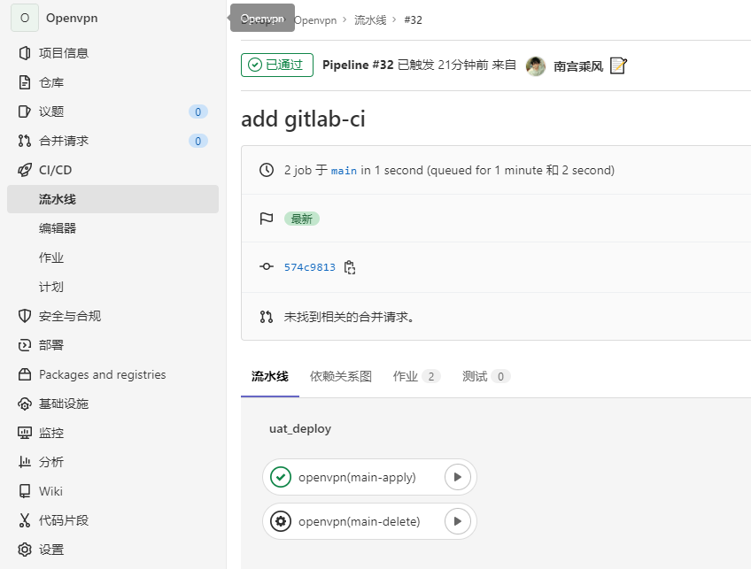

# Kubernetes安装OpenVPN

k8s部署openvpn打通k8s网络将Kubernetes集群网络暴露给本地开发网络

VPN直译就是虚拟专用通道，是提供给企业之间或者个人与公司之间[安全数据传输](https://baike.baidu.com/item/%E5%AE%89%E5%85%A8%E6%95%B0%E6%8D%AE%E4%BC%A0%E8%BE%93/3166604)的隧道，OpenVPN无疑是Linux下开源VPN的先锋，提供了良好的性能和友好的用户GUI。

它大量使用了OpenSSL加密库中的SSLv3/TLSv1协议函数库。

目前OpenVPN能在Solaris、Linux、OpenBSD、FreeBSD、NetBSD、Mac OS X与Microsoft Windows以及Android和iOS上运行，并包含了许多安全性的功能。它并不是一个基于Web的VPN软件，也不与IPsec及其他VPN软件包兼容

# 配合Gitlab的CD发布

