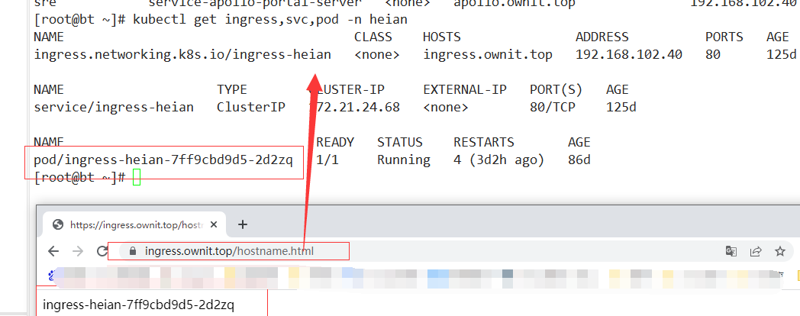

# helm部署OpenVPN 4.2.3

k8s部署openvpn打通k8s网络将Kubernetes集群网络暴露给本地开发网络

​**简单介绍**​：

VPN直译就是虚拟专用通道，是提供给企业之间或者个人与公司之间[安全数据传输](https://baike.baidu.com/item/%E5%AE%89%E5%85%A8%E6%95%B0%E6%8D%AE%E4%BC%A0%E8%BE%93/3166604)的隧道，OpenVPN无疑是Linux下开源VPN的先锋，提供了良好的性能和友好的用户GUI。

它大量使用了OpenSSL加密库中的SSLv3/TLSv1协议函数库。

目前OpenVPN能在Solaris、Linux、OpenBSD、FreeBSD、NetBSD、Mac OS X与Microsoft Windows以及Android和iOS上运行，并包含了许多安全性的功能。它并不是一个基于Web的VPN软件，也不与IPsec及其他VPN软件包兼容

官方仓库地址：[Kubeapps Hub](https://hub.kubeapps.com/charts/stable/openvpn)

客户端下载地址：[下载地址](http://www.openvpn.se/)

若该网址无法访问，可以到下面的链接进行下载

百度网盘：[点击直达](https://pan.baidu.com/s/1SCNy-DZXOHzet3SyiNYCuQ) 提取码：l0qv

## 确认集群helm安装正确

```bash
[root@master01 ~]# helm version
version.BuildInfo{Version:"v3.8.2", GitCommit:"6e3701edea09e5d55a8ca2aae03a68917630e91b", GitTreeState:"clean", GoVersion:"go1.17.5"}

```

## 下载Chart包，修改`values.yaml`​文件

```bash
helm repo add stable https://kubernetes-charts.storage.googleapis.com
helm pull stable/openvpn

或者
wget http://mirror.azure.cn/kubernetes/charts/openvpn-4.2.5.tgz
tar -zxvf openvpn-4.2.5.tgz
cd openvpn
```

## 修改配置文件,详情参考[stable/openvpn-github](https://github.com/helm/charts/tree/master/stable/openvpn)

```bash
cp  values.yaml openvpn-values.yaml


replicaCount: 1
updateStrategy: {}
imagePullSecretName:
image:
  repository: jfelten/openvpn-docker
  tag: 1.1.0
  pullPolicy: IfNotPresent
service:
  type: ClusterIP
  #externalPort: 443
  #internalPort: 443
  # hostPort: 443
  externalIPs: []
  nodePort: 32085
  # clusterIP: None
  # LoadBalancerSourceRanges: 0.0.0.0/0
  # loadBalancerIP: 10.0.0.1

  ## Here annotations can be added to the openvpn service
  # annotations:
  #   external-dns.alpha.kubernetes.io/hostname: vpn.example.com
  annotations: {}
## Here annotations can be added to the openvpn pod
# podAnnotations:
#   backup.ark.heptio.com/backup-volumes: certs
podAnnotations: {}

# Add privileged init container to enable IPv4 forwarding
ipForwardInitContainer: true

resources:
  limits:
    cpu: 300m
    memory: 128Mi
  requests:
    cpu: 300m
    memory: 128Mi

readinessProbe:
  initialDelaySeconds: 5
  periodSeconds: 5
  successThreshold: 2

persistence:
  enabled: true

  storageClass: "nfs-client"
  accessMode: ReadWriteOnce
  size: 2M
openvpn:
  # Network allocated for openvpn clients (default: 10.240.0.0).
  OVPN_NETWORK: 10.240.0.0
  # Network subnet allocated for openvpn client (default: 255.255.0.0).
  OVPN_SUBNET: 255.255.0.0
  # Protocol used by openvpn tcp or udp (default: udp).
  OVPN_PROTO: udp
  OVPN_K8S_POD_NETWORK: "172.20.0.0" #k8s pod地址
  OVPN_K8S_POD_SUBNET: "255.255.0.0"
  OVPN_K8S_SVC_NETWORK: "172.21.0.0"    #k8s svc地址
  OVPN_K8S_SVC_SUBNET: "255.255.0.0"

  DEFAULT_ROUTE_ENABLED: true

  dhcpOptionDomain: true
  # Redirect all client traffic through VPN
  redirectGateway: true

  useCrl: false
  taKey: true
  cipher: AES-256-CBC
  istio:
    enabled: false
    proxy:
      port: 15001
  iptablesExtra: []

  ccd:
    enabled: false
    config: {}

nodeSelector: {}
tolerations: []

```

相关文档参考：

[www.1nth.com/post/k8s-op...](https://www.1nth.com/post/k8s-openvpn/)

[zhuanlan.zhihu.com/p/491...](https://zhuanlan.zhihu.com/p/491930183)

[pythontaotao.github.io/2...](https://pythontaotao.github.io/2020/07/06/helm%E9%83%A8%E7%BD%B2OpenPN-4-2-3/)

## 部署并进行验证

可以直接helm部署，也可以生成yaml文件部署

方法一：

```bash
kubectl create ns openvpn
helm install openvpn -n openvpn ./ -f openvpn-values.yaml
 helm status openvpn -n openvpn
```

方法二：我才用此方法

```bash
helm install openvpn -n openvpn ./ -f openvpn-values.yaml  --dry-run --debug

生成yaml ，在进行部署
```

生成的文件

```bash
---
# Source: openvpn/templates/config-openvpn.yaml
apiVersion: v1
kind: ConfigMap
metadata:
  name: openvpn
  labels:
    app: openvpn
    chart: openvpn-4.2.5
    release: openvpn
    heritage: Helm
data:
  setup-certs.sh: |-
    #!/bin/bash
    EASY_RSA_LOC="/etc/openvpn/certs"
    cd $EASY_RSA_LOC
    SERVER_CERT="${EASY_RSA_LOC}/pki/issued/server.crt"
    if [ -e "$SERVER_CERT" ]
    then
      echo "found existing certs - reusing"
        if [ ! -e ${EASY_RSA_LOC}/pki/ta.key ]
        then
          echo "generating missed ta.key"
          openvpn --genkey --secret ${EASY_RSA_LOC}/pki/ta.key
        fi
    else
      cp -R /usr/share/easy-rsa/* $EASY_RSA_LOC
      ./easyrsa init-pki
      echo "ca\n" | ./easyrsa build-ca nopass
      ./easyrsa build-server-full server nopass
      ./easyrsa gen-dh
      openvpn --genkey --secret ${EASY_RSA_LOC}/pki/ta.key
    fi


  newClientCert.sh: |-
      #!/bin/bash
      EASY_RSA_LOC="/etc/openvpn/certs"
      cd $EASY_RSA_LOC
      MY_IP_ADDR="$2"
      ./easyrsa build-client-full $1 nopass
      cat >${EASY_RSA_LOC}/pki/$1.ovpn <<EOF
      client
      nobind
      dev tun
      remote ${MY_IP_ADDR} 443 udp
    
      cipher AES-256-CBC
    
      redirect-gateway def1
    
      <key>
      `cat ${EASY_RSA_LOC}/pki/private/$1.key`
      </key>
      <cert>
      `cat ${EASY_RSA_LOC}/pki/issued/$1.crt`
      </cert>
      <ca>
      `cat ${EASY_RSA_LOC}/pki/ca.crt`
      </ca>
      <tls-auth>
      `cat ${EASY_RSA_LOC}/pki/ta.key`
      </tls-auth>
      key-direction 1
      EOF
      cat pki/$1.ovpn

  revokeClientCert.sh: |-
      #!/bin/bash
      EASY_RSA_LOC="/etc/openvpn/certs"
      cd $EASY_RSA_LOC
      ./easyrsa revoke $1
      ./easyrsa gen-crl
      cp ${EASY_RSA_LOC}/pki/crl.pem ${EASY_RSA_LOC}
      chmod 644 ${EASY_RSA_LOC}/crl.pem

  configure.sh: |-
      #!/bin/sh

      cidr2mask() {
         # Number of args to shift, 255..255, first non-255 byte, zeroes
         set -- $(( 5 - ($1 / 8) )) 255 255 255 255 $(( (255 << (8 - ($1 % 8))) & 255 )) 0 0 0
         [ $1 -gt 1 ] && shift "$1" || shift
         echo ${1-0}.${2-0}.${3-0}.${4-0}
      }

      cidr2net() {
          local i ip mask netOctets octets
          ip="${1%/*}"
          mask="${1#*/}"
          octets=$(echo "$ip" | tr '.' '\n')

          for octet in $octets; do
              i=$((i+1))
              if [ $i -le $(( mask / 8)) ]; then
                  netOctets="$netOctets.$octet"
              elif [ $i -eq  $(( mask / 8 +1 )) ]; then
                  netOctets="$netOctets.$((((octet / ((256 / ((2**((mask % 8)))))))) * ((256 / ((2**((mask % 8))))))))"
              else
                  netOctets="$netOctets.0"
              fi
          done

          echo ${netOctets#.}
      }

      /etc/openvpn/setup/setup-certs.sh


      iptables -t nat -A POSTROUTING -s 10.240.0.0/255.255.0.0 -o eth0 -j MASQUERADE
      mkdir -p /dev/net
      if [ ! -c /dev/net/tun ]; then
          mknod /dev/net/tun c 10 200
      fi

      if [ "$DEBUG" == "1" ]; then
          echo ========== ${OVPN_CONFIG} ==========
          cat "${OVPN_CONFIG}"
          echo ====================================
      fi

      intAndIP="$(ip route get 8.8.8.8 | awk '/8.8.8.8/ {print $5 "-" $7}')"
      int="${intAndIP%-*}"
      ip="${intAndIP#*-}"
      cidr="$(ip addr show dev "$int" | awk -vip="$ip" '($2 ~ ip) {print $2}')"

      NETWORK="$(cidr2net $cidr)"
      NETMASK="$(cidr2mask ${cidr#*/})"
      DNS=$(cat /etc/resolv.conf | grep -v '^#' | grep nameserver | awk '{print $2}')
      SEARCH=$(cat /etc/resolv.conf | grep -v '^#' | grep search | awk '{$1=""; print $0}')
      FORMATTED_SEARCH=""
      for DOMAIN in $SEARCH; do
        FORMATTED_SEARCH="${FORMATTED_SEARCH}push \"dhcp-option DOMAIN-SEARCH ${DOMAIN}\"\n"
      done
      cp -f /etc/openvpn/setup/openvpn.conf /etc/openvpn/
      sed 's|OVPN_K8S_SEARCH|'"${FORMATTED_SEARCH}"'|' -i /etc/openvpn/openvpn.conf
      sed 's|OVPN_K8S_DNS|'"${DNS}"'|' -i /etc/openvpn/openvpn.conf
      sed 's|NETWORK|'"${NETWORK}"'|' -i /etc/openvpn/openvpn.conf
      sed 's|NETMASK|'"${NETMASK}"'|' -i /etc/openvpn/openvpn.conf

      # exec openvpn process so it receives lifecycle signals
      exec openvpn --config /etc/openvpn/openvpn.conf
  openvpn.conf: |-
      server 10.240.0.0 255.255.0.0
      verb 3

      key /etc/openvpn/certs/pki/private/server.key
      ca /etc/openvpn/certs/pki/ca.crt
      cert /etc/openvpn/certs/pki/issued/server.crt
      dh /etc/openvpn/certs/pki/dh.pem

      tls-auth /etc/openvpn/certs/pki/ta.key 0


      cipher AES-256-CBC

      key-direction 0
      keepalive 10 60
      persist-key
      persist-tun

      proto udp
      port  443
      dev tun0
      status /tmp/openvpn-status.log

      user nobody
      group nogroup


      push "route NETWORK NETMASK"


      push "route 172.20.0.0 255.255.0.0"


      push "route 172.21.0.0 255.255.0.0"


      OVPN_K8S_SEARCH

      push "dhcp-option DNS 172.21.16.10"
---
# Source: openvpn/templates/certs-pvc.yaml
apiVersion: v1
kind: PersistentVolumeClaim
metadata:
  name: openvpn
  labels:
    app: openvpn
    chart: openvpn-4.2.5
    release: openvpn
    heritage: Helm
spec:
  accessModes:
    - "ReadWriteOnce"
  resources:
    requests:
      storage: "2M"
  storageClassName: "nfs-client"
---
# Source: openvpn/templates/openvpn-service.yaml
apiVersion: v1
kind: Service
metadata:
  name: openvpn
  labels:
    app: openvpn
    chart: openvpn-4.2.5
    release: openvpn
    heritage: Helm
spec:
  ports:
    - name: openvpn
      port: 443
      targetPort: 443
      protocol: UDP
  selector:
    app: openvpn
    release: openvpn
  type: ClusterIP
---
# Source: openvpn/templates/openvpn-deployment.yaml
apiVersion: apps/v1
kind: Deployment
metadata:
  name: openvpn
  labels:
    app: openvpn
    chart: openvpn-4.2.5
    release: openvpn
    heritage: Helm
spec:
  replicas: 1
  selector:
    matchLabels:
      app: openvpn
      release: openvpn
  template:
    metadata:
      labels:
        app: openvpn
        release: openvpn
      annotations:
        checksum/config: c6d7908b4a71d5de2ee5f823eac2522e8de7c15ab026fcc0f4149a270886df1f
    spec:
      initContainers:
        - args:
            - -c
            - sysctl -w net.ipv4.ip_forward=1
          command:
            - /bin/sh
          image: busybox:1.29
          imagePullPolicy: IfNotPresent
          name: sysctl
          resources:
            requests:
              cpu: 1m
              memory: 1Mi
          securityContext:
            privileged: true
      containers:
      - name: openvpn
        image: "jfelten/openvpn-docker:1.1.0"
        imagePullPolicy: IfNotPresent
        command: ["/etc/openvpn/setup/configure.sh"]
        ports:
        - containerPort: 443
          name: openvpn
        securityContext:
          capabilities:
            add:
              - NET_ADMIN
        readinessProbe:
          initialDelaySeconds: 5
          periodSeconds: 5
          successThreshold: 2
          exec:
            command:
            - nc
            - -u
            - -z
            - 127.0.0.1
            - "443"
        resources:
          requests:
            cpu: "300m"
            memory: "128Mi"
          limits:
            cpu: "300m"
            memory: "128Mi"
        volumeMounts:
          - mountPath: /etc/openvpn/setup
            name: openvpn
            readOnly: false
          - mountPath: /etc/openvpn/certs
            name: certs
            readOnly: false
      volumes:
      - name: openvpn
        configMap:
          name: openvpn
          defaultMode: 0775
      - name: certs
        persistentVolumeClaim:
          claimName: openvpn

```

## 账号管理脚本

‍

下面整理一下生成clientkey的脚本,这里面的信息就是上面部署完成后输出的信息，需要修改参数`KEY_NAME`​​和`SERVICE_IP`​​,执行完成后会生成`wangwu.ovpn`​​的文件，客户端使用该文件作为连接凭证

### ​`create-client-key.sh`​​​ 创建用户

```bash
$ cat create-client-key.sh

#!/bin/bash

POD_NAME=$(kubectl get pods --namespace "default" -l "app=openvpn,release=my-openvpn" -o jsonpath='{ .items[0].metadata.name }')
SERVICE_NAME=$(kubectl get svc --namespace "default" -l "app=openvpn,release=my-openvpn" -o jsonpath='{ .items[0].metadata.name }')
SERVICE_IP=10.169.68.142
KEY_NAME=wangwu
kubectl --namespace "default" exec -it "$POD_NAME" /etc/openvpn/setup/newClientCert.sh "$KEY_NAME" "$SERVICE_IP"
kubectl --namespace "default" exec -it "$POD_NAME" cat "/etc/openvpn/certs/pki/$KEY_NAME.ovpn" > "$KEY_NAME.ovpn"

$ chmod +x get_clientkey.sh && ./get_clientkey.sh
```

### ​`rm-client-key.sh`​​​​ 注销用户

```bash
#!/usr/bin/env bash

KEY_NAME=$1
POD_NAME=$(kubectl get pods -n "openvpn" -l "app=openvpn,release=openvpn" -o jsonpath='{.items[0].metadata.name}')
kubectl -n "openvpn" exec -it "$POD_NAME" /etc/openvpn/setup/revokeClientCert.sh $KEY_NAME
```

### 创建客户端密钥

```bash
[root@iZwz98n1yl2yxjc2xpwt8dZ openvpn]#  kubectl --namespace "openvpn" get svc
NAME      TYPE           CLUSTER-IP    EXTERNAL-IP     PORT(S)         AGE
openvpn   LoadBalancer   172.19.77.8   119.23.xxx.xx   443:30924/TCP   8d

[root@iZwz98n1yl2yxjc2xpwt8dZ openvpn]# ./create-client-key.sh sunnyhaha
[root@iZwz98n1yl2yxjc2xpwt8dZ openvpn]# ll user-openvpn-20220402/sunnyhaha.ovpn 
-rw-r--r-- 1 root root 7445 Apr  2 09:50 user-openvpn-20220402/sunnyhaha.ovpn
```

上面的命令会生成client.ovpn配置文件，因为前面用Helm部署openvpn时，创建的Servie是ClusterIP类型的，生成的配置文件 中的VPN服务地址会有错误，需要修改这个配置文件，将remote配置修改如下地址为k8s边缘节点的ip，端口为前面暴露的1194端口，同时删除redirect-gateway def1这行内容

## 解析k8s内部svc

部署完成之后有个坑,不能解析k8s内部svc

```bash
nslookup kubernetes.default.svc.cluster.local
服务器:  UnKnown
Address:  192.168.1.1

DNS request timed out.
    timeout was 2 seconds.
DNS request timed out.
```

### 查看openvpn服务端配置

```bash
kubectl get cm -n openvpn openvpn -oyaml
......
push "dhcp-option DNS OVPN_K8S_DNS"
```

因为我用的是node-local-dns,pod的DNS地址会变成__PILLAR__LOCAL__DNS__的默认地址169.254.20.10所以导致不能解析

### 修改服务端配置

```bash
kubectl get svc -n kube-system -l k8s-app=kube-dns -o jsonpath='{$.items[*].spec.clusterIP}'
10.68.0.2
kubectl get cm -n openvpn openvpn -oyaml
push "dhcp-option DNS 10.68.0.2"
```

​​

​​

​​

​​

‍
